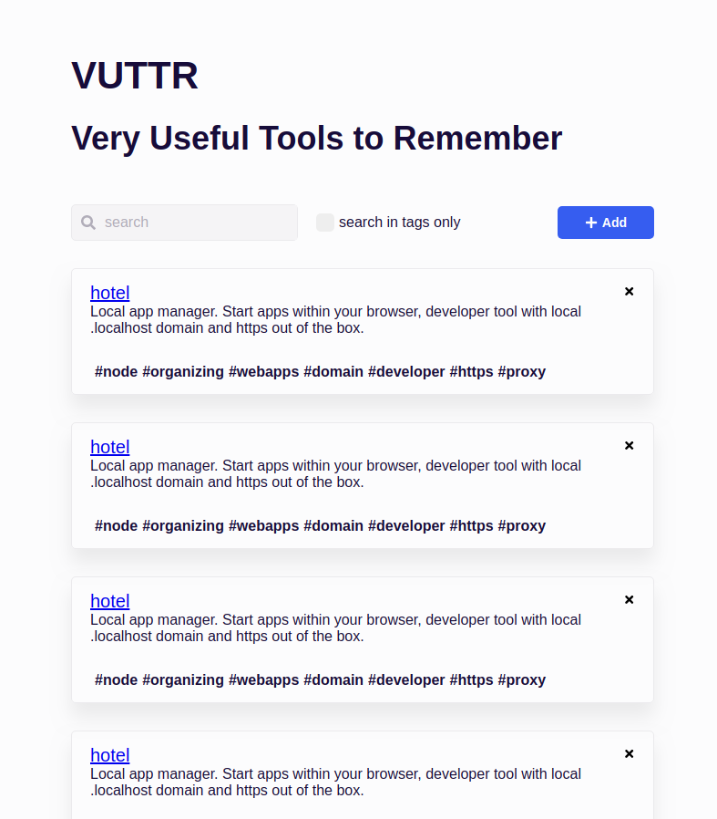
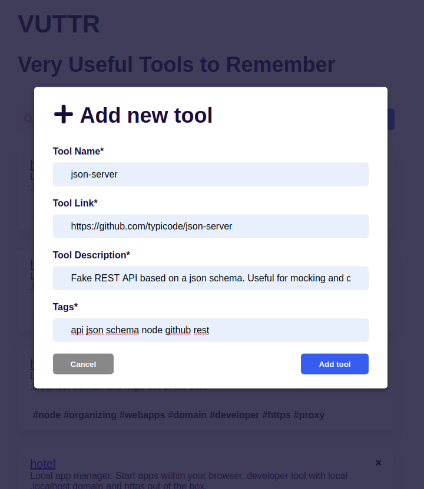
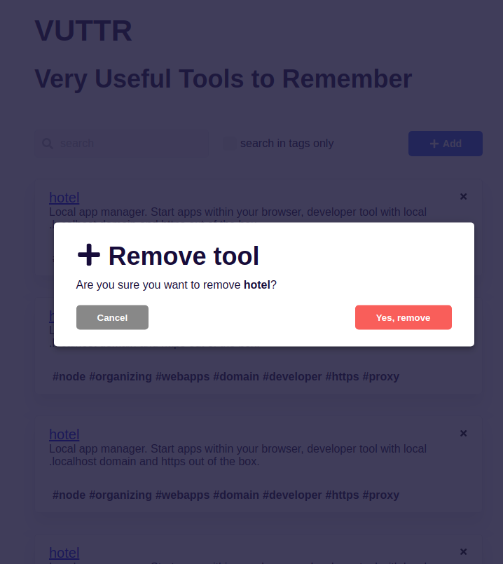
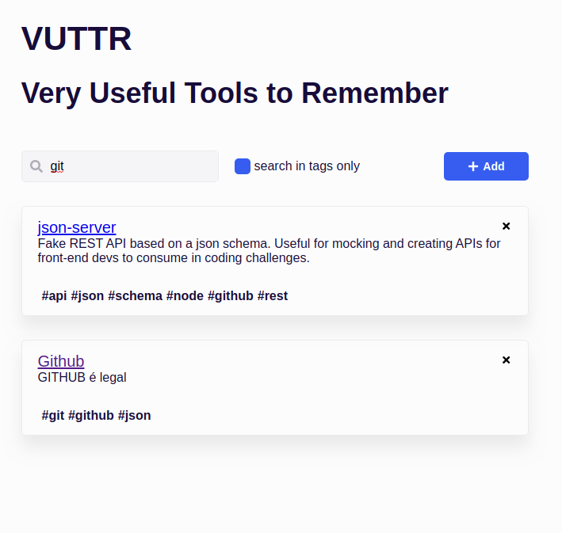

# VUTTR - Very Useful Tools to Remember

This project was created to BossaBox Challenge - Front-end.

#### List items

#### Add new tool (modal)

#### Remove tool (modal)

#### Serach with ou without tag

## How to Start Application?

### Run the API

Download the [BossaBox api](https://gitlab.com/bossabox/challenge-fake-api/)
Run `npm install` or `yarn` on api folder
and `npx json-server db.json`

### Run the application frontend

Download the 
Run `npm install` or `yarn` on folder
and `npm start` or `yarn start`

Best regards,

**Gustavo Luiz Bispo dos Santos**
**email:** gustavo.santos@ccc.ufcg.edu.br
